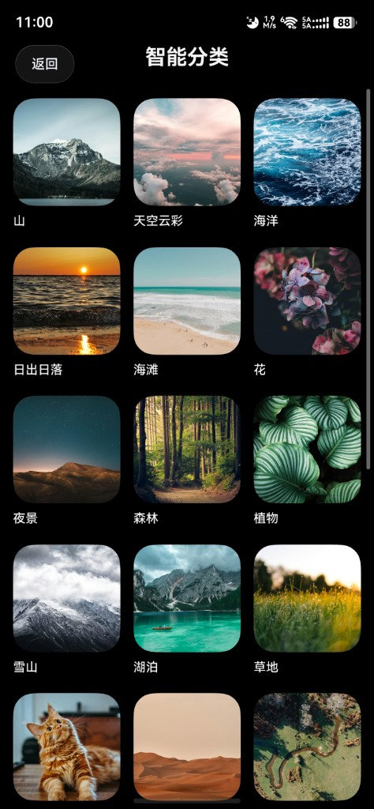
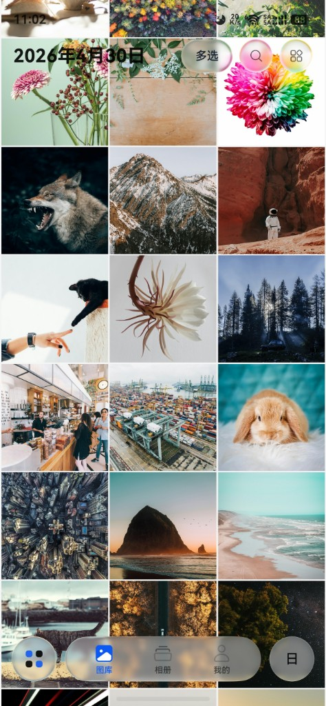
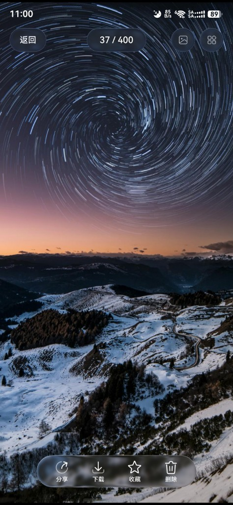
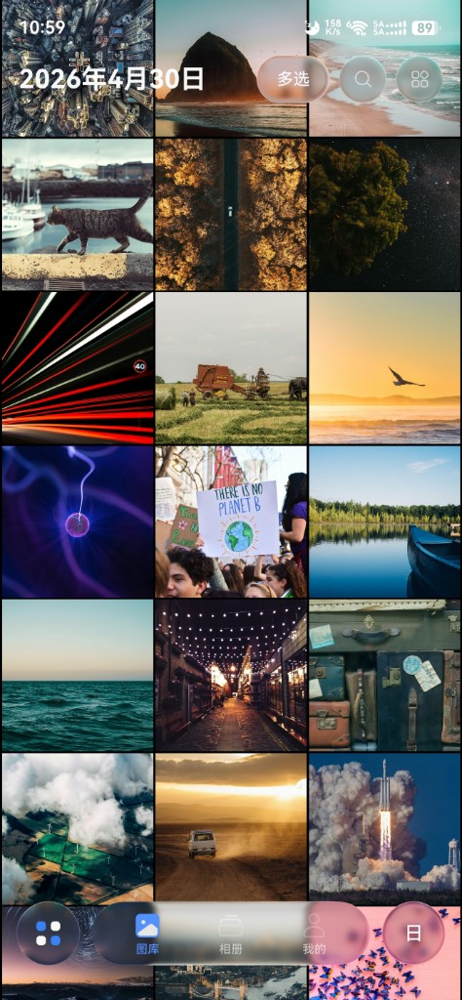
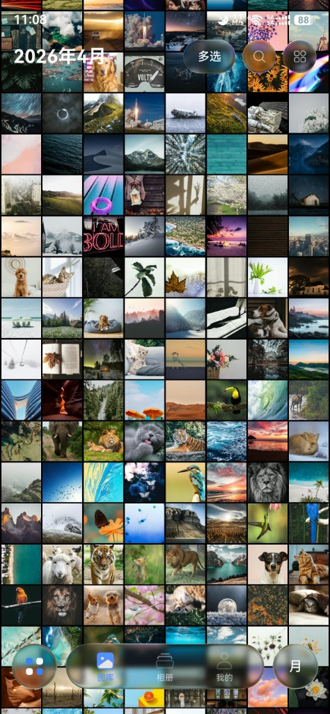
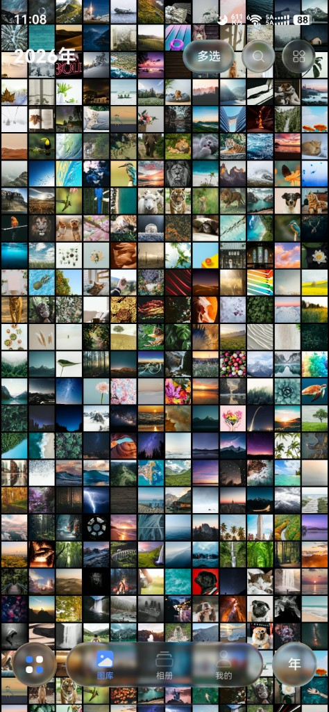
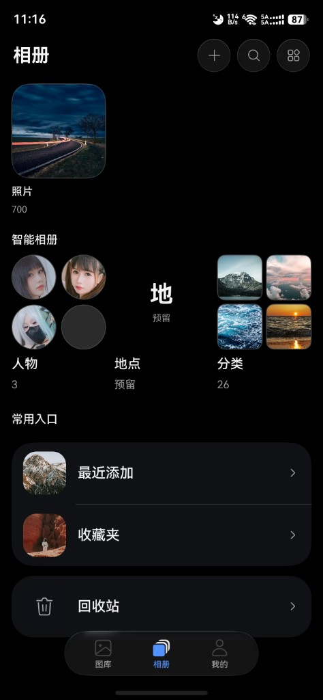

# FMphoto（HarmonyOS）

一个面向鸿蒙设备的飞牛 NAS 相册客户端，专注于“更顺手的图库交互 + 更出彩的观感呈现”。

## 点亮STAR助我破鼎

## 项目亮点

- **HDR Vivid 显示链路**：缩略图与大图解码支持 HDR，查看原图时在支持机型上可获得更高动态范围与更丰富层次。
- **沉浸光感视效**：以全屏浏览、时间线组织与高质量缩略图为核心，突出照片氛围与临场感。
- **鸿蒙相册式操作习惯**：长按多选、连续划选、下拉刷新、触觉反馈等交互已做针对性优化。

## 介绍图

| 智能分类 | 时间线网格 | 搜索结果 | 大图预览（HDR） |
| --- | --- | --- | --- |
|  |  |  |  |
| 按日聚合浏览 | 月视图 | 年视图 | 相册首页 |
|  |  |  |  |

## 当前功能

- **登录与首页**：支持 HTTP/HTTPS 登录、会话保持，内嵌飞牛网页入口。
- **图库浏览**：时间线浏览，支持日 / 月 / 年切换，网格与全屏预览联动。
- **智能能力**：支持 AI 搜索、智能分类、媒体分类、人物聚合（依赖 NAS 侧能力开通）。
- **媒体预览**：图片、GIF、视频可预览；支持查看详情、查看原图、系统分享。
- **文件操作**：支持上传、下载、删除（回收站）、多选批量操作、收藏与回收站管理。

## 开发进展

- 已完成：时间轴浏览、收藏时间线、日/月/年视图切换。
- 持续优化：更符合鸿蒙风格的动画与转场体验。
- 规划中：文件夹分类等能力。

## 构建与产物

- 本地未签名包默认路径：`entry/build/default/outputs/default/entry-default-unsigned.hap`
- 推送 `v*` 标签后，可通过 GitHub Actions 自动上传 Release 构建产物。

## 使用说明

安装后填写 NAS 地址与账号即可登录使用。若部分入口无数据，请先在 NAS 管理端确认相册服务、AI 能力与账户权限已启用。

## 注意事项

- 本项目为**非官方客户端**，功能可用性受 NAS 系统版本与服务状态影响。
- 涉及账号登录、网络与证书（HTTPS）时，请自行确认安全性与可信来源。

