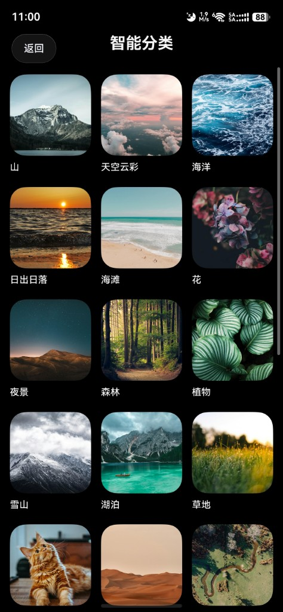
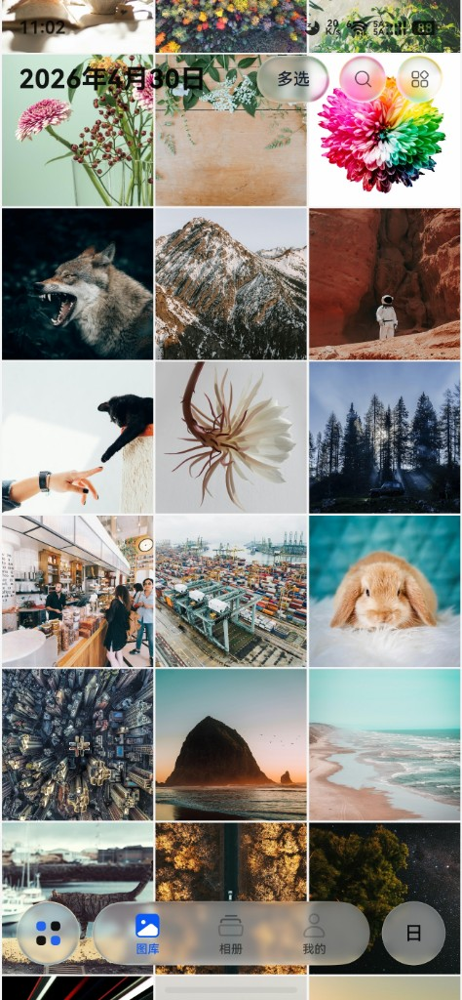
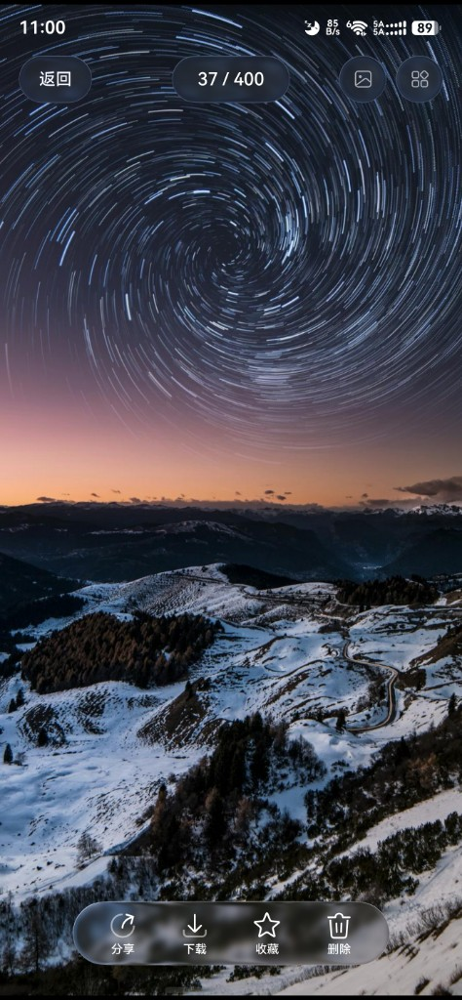
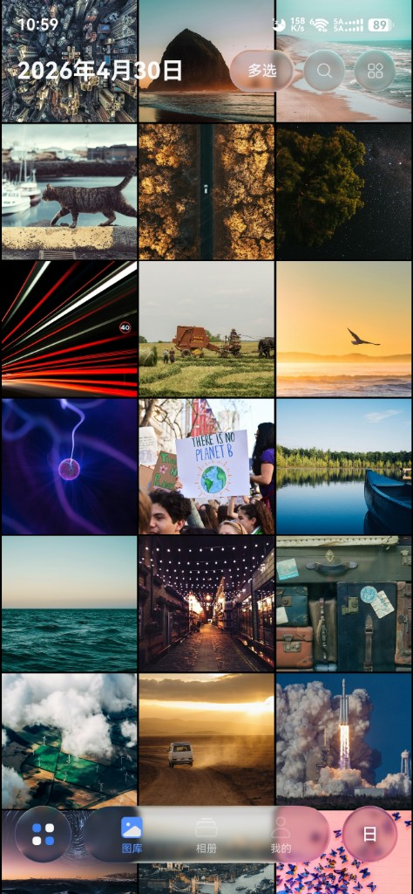
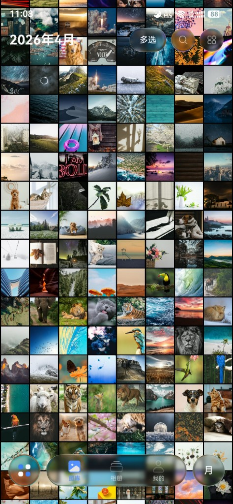
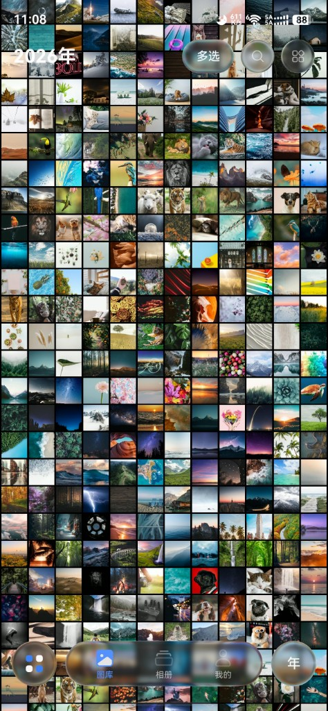
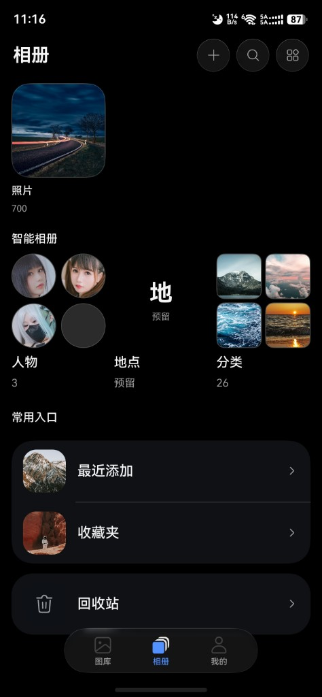

# FMphoto（HarmonyOS）

一个面向鸿蒙设备的飞牛 NAS 相册客户端，专注于“更顺手的图库交互 + 更出彩的观感呈现”。

## ** 点亮STAR助我破鼎 **

## 飞牛鸿蒙版官方APP已经开始内测申请，相信不久之后就能上线啦！想申请体验内测版的朋友们点击下方链接进入官方社区帖子查看详细信息：https://club.fnnas.com/forum.php?mod=viewthread&tid=67389&extra=page%3D1

## 项目亮点

- **HDR Vivid 显示链路**：缩略图与大图解码支持 HDR，查看原图时在支持机型上可获得更高动态范围与更丰富层次。
- **沉浸光感视效**：以全屏浏览、时间线组织与高质量缩略图为核心，突出照片氛围与临场感。
- **鸿蒙相册式操作习惯**：长按多选、连续划选、下拉刷新、触觉反馈等交互已做针对性优化。

## 介绍图

| 智能分类 | 时间线网格 | 搜索结果 | 大图预览（HDR） |
| --- | --- | --- | --- |
|  |  |  |  |
| 按日聚合浏览 | 月视图 | 年视图 | 相册首页 |
|  |  |  |  |

## 当前功能

- **登录与首页**：支持 FN ID（FN Connect 解析）、HTTP/HTTPS 登录、会话保持，内嵌飞牛网页入口。
- **图库浏览**：时间线浏览，支持日 / 月 / 年切换，网格与全屏预览联动。
- **智能能力**：支持 AI 搜索、智能分类、媒体分类、人物聚合（依赖 NAS 侧能力开通）。
- **媒体预览**：图片、GIF、视频可预览；支持查看详情、查看原图、系统分享。
- **文件操作**：支持上传、下载、删除（回收站）、多选批量操作、收藏与回收站管理。
- **本地相册同步**：将本机照片备份至 NAS（详见下文「本地相册同步与受控权限」）。

## 本地相册同步与受控权限

### 功能说明

源码中已实现**全自动相册同步**：扫描本机相册、与 NAS 全库指纹比对、显示待同步数量并批量上传。

由于鸿蒙将 `ohos.permission.READ_IMAGEVIDEO` 列为**受控权限**，除在 `module.json5` 声明外，还必须写入**签名 Profile 的 ACL**。因此：

- **公开发布给所有用户的安装包**：无法默认启用全自动扫描（系统不会授予该权限）。
- **自行编译并本地签名**：可在华为开发者中心为**你的包名**申请 ACL，获得与维护者相同的全自动体验。
- **无 ACL 时**：应用会自动回退为系统 **PhotoViewPicker 手动选图**同步（单次最多 500 张），无需受控权限。

### 自行申请 `READ_IMAGEVIDEO`（不上架亦可）

以下步骤适用于个人使用或内部分发，**不要求上架应用市场**。

1. **注册开发者**  
   登录 [华为开发者联盟](https://developer.huawei.com/consumer/cn/) 与 [AppGallery Connect](https://developer.huawei.com/consumer/cn/service/josp/agc/index.html)。

2. **创建 / 选择应用**  
   包名须与工程一致（见 `AppScope/app.json5` 中的 `bundleName`）。

3. **申请受限权限**  
   - 进入 AGC → 你的应用 → **应用服务** → **权限管理**（或「申请权限 / 受限开放权限」）。  
   - 申请 `ohos.permission.READ_IMAGEVIDEO`。  
   - 用途说明示例：*个人 NAS 相册备份，仅本地扫描未同步照片并上传至用户自有服务器，不上传至第三方。*  
   - 等待审核通过（个人开发者自用场景通常可获批）。

4. **生成带 ACL 的 Profile（.p7b）**  
   - 在 DevEco Studio：**File → Project Structure → Signing Configs**，或 AGC → **用户与访问 → 证书管理**。  
   - 创建调试或发布证书，生成 Profile 时勾选已获批的 `READ_IMAGEVIDEO`。  
   - 下载 `.p7b`、`.p12`、`.cer`，保存在本机**不要提交到 Git**。

5. **配置本地签名**  
   ```bash
   cp build-profile.json5.example build-profile.json5
   ```  
   编辑 `build-profile.json5`，填入本机证书路径与密码（该文件已在 `.gitignore` 中忽略）。

6. **编译安装**  
   使用 DevEco 或 `hvigorw` 签名打包，安装到手机。  
   首次使用「同步本地照片」时，在系统弹窗中选择**允许**访问相册。

7. **分发给他人（可选）**  
   使用同一套带 ACL 的 Profile 签名；将对方设备 UDID 加入 Profile 设备列表（调试证书有数量上限），再安装你签名的 `.hap`。

### 无 ACL 时的用法

图库 → **更多** → **同步本地照片**：若未获得相册读取权限，会提示手动选择照片，通过系统相册 Picker 挑选后上传。

## 开发进展

- 已完成：时间轴浏览、收藏时间线、日/月/年视图切换、本地相册同步（含 NAS 指纹比对与本机账本）。
- 持续优化：更符合鸿蒙风格的动画与转场体验。
- 规划中：文件夹分类等能力。

## 构建与产物

### 首次克隆后

```bash
cp build-profile.json5.example build-profile.json5
# 编辑 build-profile.json5，填入本地签名路径（勿提交）
```

### 产物路径

- 本地未签名包默认路径：`entry/build/default/outputs/default/entry-default-unsigned.hap`
- 推送 `v*` 标签后，可通过 GitHub Actions 自动上传 **未签名** Release 产物。

**安全约定**：只提交/发布未签名 HAP。**签名包、`.p12` / `.p7b` / `.cer`、以及含密码的 `build-profile.json5` 一律不得入库或上传 Release。**

## 使用说明

安装后填写 NAS 地址与账号即可登录使用。若部分入口无数据，请先在 NAS 管理端确认相册服务、AI 能力与账户权限已启用。

## 注意事项

- 本项目为**非官方客户端**，功能可用性受 NAS 系统版本与服务状态影响。
- 涉及账号登录、网络与证书（HTTPS）时，请自行确认安全性与可信来源。
- **切勿将 `build-profile.json5`、`.p12`、`.p7b` 等签名材料提交到公开仓库。**
